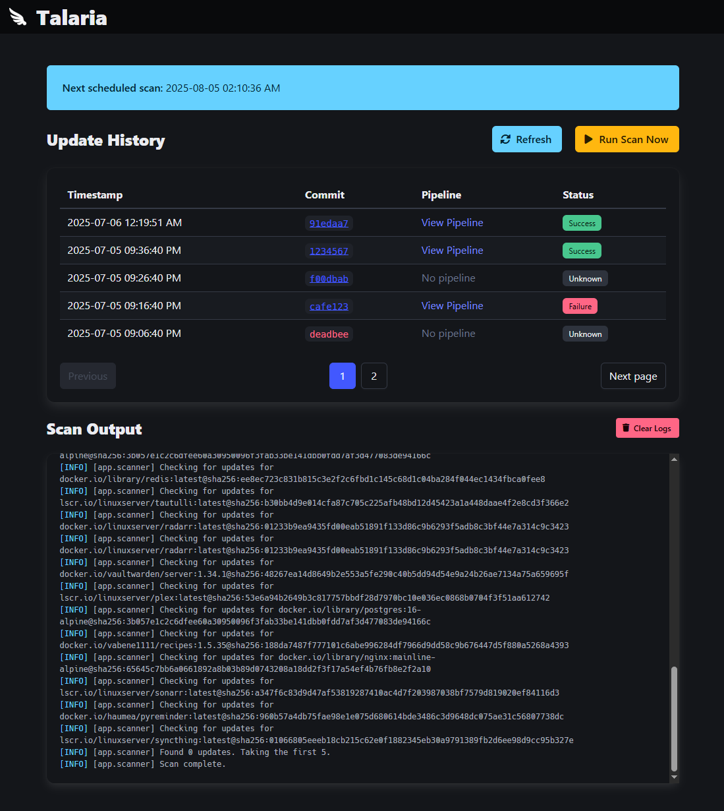

# talaria

[](https://gitlab.com/haondt/talaria/-/pipelines)
[](LICENSE)

**talaria** is an intelligent Docker image updater that automatically scans your Docker Compose files, checks for newer image versions, and creates Git commits with the updates. It provides a modern web interface for monitoring and controlling the update process.

talaria is heavily based on [Talos](https://gitlab.com/haondt/talos), but is lighter weight and includes just a subset of Talos' features.



## 🛠️ Installation

### Docker Compose (Recommended)

```yml
services:
  talaria:
    image: haumea/talaria:latest
    volumes:
        - talaria-data:/data
volumes:
  talaria-data:
```

### Local Development

1. **Install dependencies**:
   ```bash
   pip install -r requirements.txt
   ```

2. **Install system dependencies**:
   ```bash
   sudo apt-get install git skopeo
   ```

3. **Set up environment**:
   ```bash
   cp example.env .env
   # Edit .env with your configuration
   ```

4. **Run the application**:
   ```bash
   python -m app
   ```

## 🚀 Features

- **Automated Image Updates**: Scans Docker Compose files for outdated images and updates them
- **Semantic Versioning**: Intelligent version comparison with support for patch, minor, and major updates
- **Git Integration**: Automatic commit creation and pushing to configured repositories
- **Web Interface**: Real-time monitoring with HTMX-powered updates
- **Authentication**: Support for Docker Hub authentication to access private images and increase pull limits
- **Manual Triggers**: Ability to run scans on-demand
- **Configurable Update Policies**: Control which types of updates to apply


## ⚙️ Configuration

### Environment Variables

| Variable | Description | Default |
|----------|-------------|---------|
| `TL_ENVIRONMENT` | Environment (dev/prod) | `prod` |
| `TL_GIT_REPO_URL` | Git repository URL | Required |
| `TL_GIT_BRANCH` | Git branch to work with | `main` |
| `TL_GIT_REPO_PATH` | Local repository path | `/data/repository` |
| `TL_GIT_AUTH_TOKEN` | Git authentication token | Required |
| `TL_GIT_USER_EMAIL` | Git commit author email | `talaria@example.com` |
| `TL_GIT_USER_NAME` | Git commit author name | `talaria` |
| `TL_UPDATE_DELAY` | Scan interval (e.g., `30d`, `1h`) | `1d` |
| `TL_DB_PATH` | SQLite database path | `/data/talaria.db` |
| `TL_LOG_LEVEL` | Logging level | `INFO` |
| `TL_LOG_TEMPLATE` | Log message format | Auto-detected based on environment |
| `TL_SERVER_PORT` | Web interface port | `5001` |
| `TL_WEBHOOK_API_KEY` | Bearer token for GitLab webhook authentication | `57d88647-208e-4ee1-88fc-365836f95ee4` (hardcoded) |
| `TL_DOCKER_COMPOSE_FILE_PATTERN` | File pattern for compose files | `docker-compose*.y*ml` |
| `TL_VALID_RELEASES` | Valid release tags regex | `latest\|stable\|mainline\|develop` |
| `TL_TALOS_COMPAT` | Enable Talos compatibility mode | `false` |
| `TL_MAX_CONCURRENT_PUSHES` | Max concurrent image updates | `5` |
| `TL_DOCKER_USERNAME` | Docker Hub username | Optional |
| `TL_DOCKER_PASSWORD` | Docker Hub password | Optional |
| `TL_DOCKER_AUTH_FILE` | Docker auth file path | `/data/skopeo-auth.json` |
| `TL_SKOPEO_CACHE_DURATION` | Cache duration for skopeo results | `12h` |
| `TL_SKOPEO_CACHE_VARIANCE` | Cache variance factor | `0.1` |
| `TL_HISTORY_PAGE_SIZE` | Default pagination size for history | `5` |

### Time Span Format

Configuration supports flexible time spans:
- `1h30m` - 1 hour 30 minutes
- `1d 2h 30m 40s` - 1 day 2 hours 30 minutes 40 seconds

### Docker Compose Extensions

talaria supports custom extensions in Docker Compose files to control update behavior:

#### x-talaria Extension (Recommended)

Use the `x-talaria` extension to configure update policies for specific services:

```yaml
services:
  my-service:
    image: nginx:1.25
    x-talaria:
      bump: minor      # major, minor, patch, or digest
      skip: false      # true to skip this service
```

#### x-tl Extension (Compact Format)

Use the `x-tl` extension for a more compact configuration:

```yaml
services:
  my-service:
    image: nginx:1.25
    x-tl: "^"          # ^ = minor, ~ = patch, + = major, @ = digest, x = skip
```

#### x-talos Extension (Legacy Compatibility)

When `TL_TALOS_COMPAT=true`, it will be able to parse the `x-talos` and `x-tl` extension formats as provided by [Talos](https://gitlab.com/haondt/talos):

```yaml
services:
  my-service:
    image: nginx:1.25
    x-talos:
      bump: minor
      skip: false
  my-other-service:
    image: nginx:1.25
    x-tl: +!
  my-other-other-service:
    image: nginx:1.25
    x-tl: ^:!??*
```

### Update Policy Configuration

#### Bump Types

- **`major`** - Allow major version updates (e.g., 1.0.0 → 2.0.0)
- **`minor`** - Allow minor version updates (e.g., 1.0.0 → 1.1.0)
- **`patch`** - Allow patch version updates (e.g., 1.0.0 → 1.0.1)
- **`digest`** - Only update digest (e.g., 1.0.0 → 1.0.0@sha256:...)

#### x-tl Short Format

| Symbol | Meaning | Example |
|--------|---------|---------|
| `^` | Minor updates | 1.0.0 → 1.1.0 |
| `~` | Patch updates | 1.0.0 → 1.0.1 |
| `+` | Major updates | 1.0.0 → 2.0.0 |
| `@` | Digest only | 1.0.0 → 1.0.0@sha256:... |
| `x` | Skip service | No updates |

### Example Docker Compose Configuration

```yaml
services:
  # Allow minor updates
  web:
    image: nginx:1.25
    x-talaria:
      bump: minor
      skip: false

  # Allow only patch updates
  api:
    image: node:18-alpine
    x-talaria:
      bump: patch
      skip: false

  # Skip this service entirely
  legacy:
    image: old-app:1.0
    x-talaria:
      bump: major
      skip: true

  # Compact format
  cache:
    image: redis:7-alpine
    x-tl: "~"  # patch updates only
```

## 🔗 GitLab Webhooks

talaria can receive webhook notifications from GitLab to update pipeline status for commits. This allows the web interface to show whether commits have passed or failed their CI/CD pipelines.

### Webhook Configuration

1. **In GitLab, go to your project settings:**
   - Navigate to **Settings** → **Webhooks**
   - Click **Add new webhook**

2. **Configure the webhook:**
   - **URL**: `http://your-talaria-server:5001/api/webhooks/gitlab`
   - **Trigger**: Select **Pipeline events**
   - **SSL verification**: Enable if using HTTPS
   - **Custom Headers**: Add `Authorization: Bearer <your configured api key>`

3. **Test the webhook:**
   - Click **Test** → **Pipeline events**
   - Check that you receive a `200 OK` response

### Pipeline Status Updates

When GitLab sends pipeline events, talaria will:

1. **Parse the webhook payload** to extract commit hash and pipeline information
2. **Update the commit record** in the database with:
   - Pipeline URL
   - Pipeline status (success/failure)
   - Pipeline timestamp
   - Pipeline duration
3. **Broadcast updates** to connected web clients via WebSocket

### Web Interface Integration

The web interface will automatically show:
- **Pipeline status badges** (Success/Failure/Unknown)
- **Pipeline links** to view details in GitLab
- **Real-time updates** when pipeline status changes

## 🔧 Usage

### Web Interface

Access the web interface at `http://localhost:5001`

## 📄 License

This project is licensed under the MIT License - see the [LICENSE](LICENSE) file for details.
